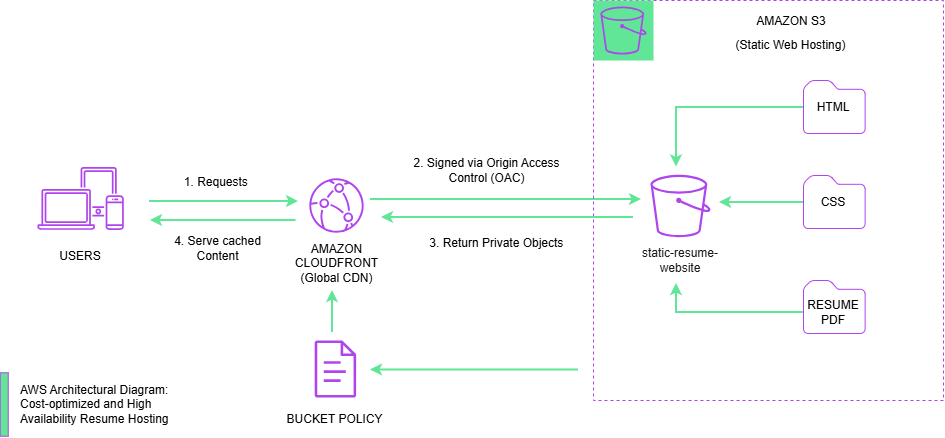

# My First Cloud Project: Static Resume Website

As a UX/UI designer pivoting into systems architecture, this project marks my first time setting up and configuring live cloud services.

## The Cloud Architecture
To keep this site fast, secure, and incredibly cost-effective, I am building it using a modern cloud-native approach instead of a traditional web server:
* **Amazon S3:** Used for object storage to host the static HTML and CSS frontend files.
* **Amazon CloudFront:** Acting as the Content Delivery Network (CDN) to securely serve the site globally with low latency.

## Core Technologies Used
* **Frontend:** HTML, CSS (Focusing on a clean, responsive layout)
* **Cloud Infrastructure:** Amazon Web Services (AWS)
* **Environment & Version Control:** WSL (Windows Subsystem for Linux), VS Code Editor, Git/Github

## What I am Learning
Because this is my first deep dive into AWS, I am actively building skills in:
* **Identity & Access management (IAM):** Managing bucket policies and access controls securely.
* **Cloud Storage Fundamentals:** Understanding how objects storage works compared to local file systems.
* **Content Delivery:** Learning how caching and edge locations work via a CDN to optimize web services.

## Roadmap
- [X] Create initial HTML and CSS files.
- [X] Upload HTML and CSS files to S3.
- [X] Configure S3 bucket for static website hosting.
- [X] Point a CloudFront distribution to the bucket for global delivery.
- [X] Secure S3 Origin with Origin Access Control (OAC)

[!NOTE] Why is the S3 bucket private if visitors can still see the site?

The S3 bucket itself blocks all public internet access. When a user visits the site, CloudFront acts as an authorized proxy. CloudFront uses Origin Access Control (OAC) to sign requests behind the scenes. S3 verifies this cryptographic signature against its Bucket Policy and grants access only to CloudFront, ensuring no one can access or download files directly from S3

